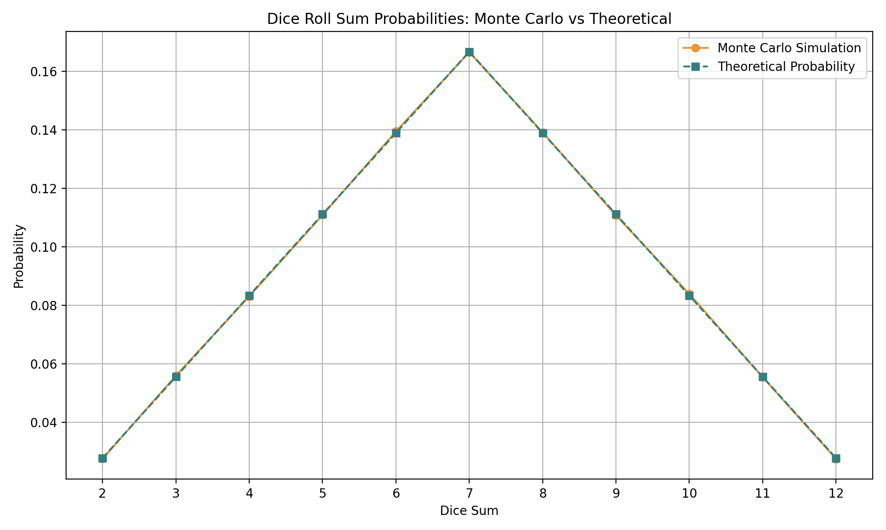
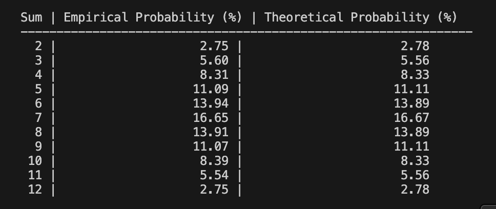

# Task7: Monte Carlo Simulation: Dice Roll Probability Analysis

## Task Summary

The Monte Carlo method is used to simulate rolling two six-sided dice a large number of times. The objective is to empirically determine the probabilities of each possible sum (ranging from 2 to 12) and compare them with the theoretical probabilities derived through analytical calculations.

## Implementation Details

**Simulation Size**: 1,000,000 iterations
**Process**:

  * Roll two dice using random number generation.
  * Record the sum of each roll.
  * Count the occurrences of each sum.
  * Compute empirical probabilities.

**Comparison**:

  * Compare the simulation results against theoretical values.

## Results

### Probability Plot

This graph visualizes the empirical (Monte Carlo simulation) probabilities against the theoretical ones.

* **Orange Line with Circles**: Monte Carlo simulation results
* **Teal Dashed Line with Squares**: Theoretical probabilities based on combinatorial calculations

As observed, the Monte Carlo curve nearly overlaps the theoretical curve, confirming the accuracy of the simulation.

### Probability Table

This table compares the probabilities as percentages:

* **Empirical Probability (%)**: From simulation
* **Theoretical Probability (%)**: Based on 36 equally likely dice outcomes

The minor differences (typically less than 0.1%) fall within expected statistical variation for 1 million rolls.

## Conclusion

The Monte Carlo simulation accurately approximates the theoretical distribution of dice roll sums. This demonstrates the effectiveness of Monte Carlo methods for modeling and approximating probabilistic events. The close agreement between the simulated and theoretical results validates both the simulation implementation and the underlying statistical theory.

This exercise also highlights how empirical methods can serve as useful tools in validating or exploring probability distributions when analytical approaches are impractical or unavailable.

> Created with Python, matplotlib, and random libraries.